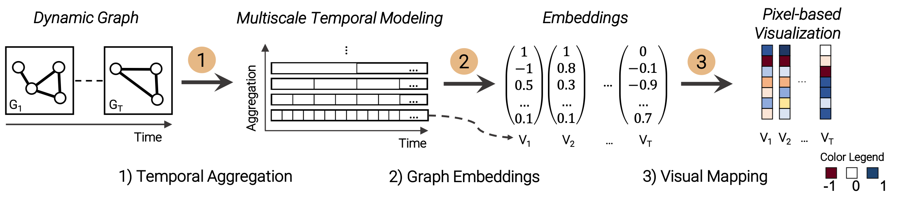
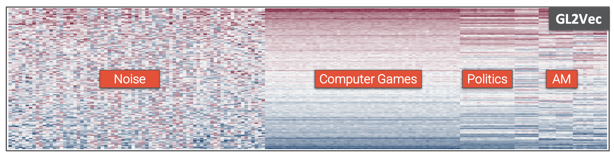

# dg2pix (dynamic graph to pixel-based visualization)

Pixel-Based Visual Analysis of Dynamic Graphs - [[Paper]](https://arxiv.org/abs/2009.07322)

<p align="center">
    
  
</p>
  
## Abstract

<p align="justify">
Presenting long sequences of dynamic graphs remains challenging due to the underlying large-scale and high-dimensional data. We propose dg2pix, a novel pixel-based visualization technique, to visually explore temporal and structural properties in long sequences of large-scale graphs. The approach consists of three main steps: (1) the multiscale modeling of the temporal dimension; (2) unsupervised graph embeddings to learn low-dimensional representations of the dynamic graph data; and (3) an interactive pixel-based visualization to simultaneously explore the evolving data at different temporal aggregation scales. dg2pix provides a scalable overview of a dynamic graph, supports the exploration of long sequences of high-dimensional graph data, and enables the identification and comparison of similar temporal states. We show the applicability of the technique to synthetic and real-world datasets, demonstrating that temporal patterns in dynamic graphs can be identified and interpreted over time. dg2pix contributes a suitable intermediate representation between node-link diagrams at the high detail end and matrix representations on the low detail end.
</p>


_This repository provides a Python/Javascript implementation of dg2pix prototype as described in the paper:_

```bibtex
@inproceedings{CaJaSc+2020dg2pix,
    author = {Cakmak, Eren and Jäckle, Dominik and Schreck, Tobias and Keim, Daniel A.},
    booktitle = {Symposium on Visualization in Data Science (VDS) at IEEE VIS 2020},
    title = {dg2pix: Pixel-Based Visual Analysis of Dynamic Graphs},
    year = {2020}
}
```

---

### How to locally run the prototype

1. Install Python requirements

```bash
pip install -r requirements.txt
```

2. Run ```app.py``` with Pyhton e.g.,

```bash
python3 app.py
```

3. Access the prototype implementation in the web browser

```url
http://127.0.0.1:8000/
```

---

### How to locally develop the prototype

First, install the `node.js` modules and run wepack. Move the to the `/frontend` directory and run the following commands while working on the frontend:

```bash
npm install
npm run watch
```

---

### Datasets & Graph Embeddings

The following real-world dataset is currently used in the prototype [Reddit Hyperlink Network](https://snap.stanford.edu/data/soc-RedditHyperlinks.html). The graphs were embedded using the [Karate Club](https://github.com/benedekrozemberczki/karateclub) library.

---

## License
Released under GNU General Public License v3.0. See the [LICENSE](LICENSE) file for details. The prototype was developed by Eren Cakmak from the [Data Analysis and Visualization Group](https://www.vis.uni-konstanz.de/) at the University Konstanz funded by the Deutsche Forschungsgemeinschaft (DFG, German Research Foundation) under Germany's Excellence Strategy – EXC 2117 – 422037984 and the European Union’s Horizon 2020 research and innovation programme under grant agreement No 830892.
